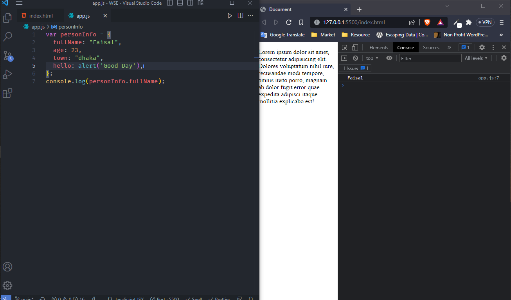

<!---- readme --->

# readme

## readme

### readme

#### readme

##### readme

---

<p> this is faisal ahmed. I am reading university of rajshahi </p>

<i> this is italic</i>  
_this is italic_

**this is bold**  
~~delete~~  
`<h1>Bangladesh</h1>`

```html
<!DOCTYPE html>
<html lang="en">
  <head>
    <meta charset="UTF-8" />
    <meta http-equiv="X-UA-Compatible" content="IE=edge" />
    <meta name="viewport" content="width=device-width, initial-scale=1.0" />
    <title>Document</title>
  </head>

  <body></body>
</html>
```

## ordered list

1. item 1
2. item 2
   1. sub item
   2. sub item
   3. sub item
3. item 3
4. item 4

## unordered list

- item
- item
  - sub item
  - sub item
  - sub item
- item
- item

## task list

- [x] task
- [x] task
- [] task

## automatic link

http://www.google.com  
[Google](http://www.google.com)  
[Facebook](http://www.facebook.com)  
[Youtube](http://www.youtube.com)

## Disabled Link

`http://www.google.com`

## Image syntex

 

## table   
| name | email  |
| ---- | -------  |
| Faisal | abe@gmail.com